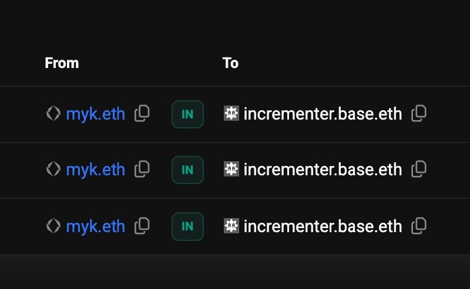

# basenames-module

A Solidity abstract contract that lets any smart contract register and own a primary [Basename](https://www.base.org/names) (`name.base.eth`) on Base mainnet.

## Live Example

[`incrementer.base.eth`](https://www.base.org/name/incrementer) → [`0x2287ECB162bC14d69f336541cEEfFf738f57d676`](https://basescan.org/address/0x2287ecb162bc14d69f336541ceefff738f57d676)

A public counter contract on Base that inherited this module. myk.eth registered `incrementer.base.eth` — and both forward and reverse resolution work:



Source: [mykclawd/basename-counter](https://github.com/mykclawd/basename-counter)

---

## Installation

```bash
forge install mykclawd/basenames-module
```

Or copy `src/` into your project.

---

## Usage

### 1. Inherit `BasenameRegistrar`

> ⚠️ **Access control required.** `_registerBasename`, `_setForwardResolution`, and `_setPrimaryBasename` are `internal` — they cannot be called from outside. Any public wrapper you write **must be protected** (e.g. `onlyOwner`). Without it, anyone could drain your contract's ETH or overwrite your name.

```solidity
import {BasenameRegistrar} from "basenames-module/src/BasenameRegistrar.sol";
import {Ownable} from "@openzeppelin/contracts/access/Ownable.sol";

contract MyContract is BasenameRegistrar, Ownable {
    constructor()
        BasenameRegistrar(address(0), address(0), address(0))
        Ownable(msg.sender)
    {}

    /// @notice Step 1: Register the name and set reverse record. Send ETH with this call.
    function registerBasename(string memory name, uint256 duration)
        external payable onlyOwner
    {
        _registerBasename(name, duration);
    }

    /// @notice Step 2: Set the forward addr record (no ETH needed, separate tx).
    /// @dev Pass the bare label only: "myapp", not "myapp.base.eth".
    function setForwardResolution(string memory name) external onlyOwner {
        _setForwardResolution(name);
    }

    /// @notice Recover any ETH stranded by a failed refund from registerBasename.
    /// @dev If this contract's receive() ever reverts during a refund, overpaid ETH
    ///      gets stuck here. This function lets the owner recover it.
    function rescueEth() external onlyOwner {
        (bool ok, ) = msg.sender.call{value: address(this).balance}("");
        require(ok, "ETH transfer failed");
    }
}
```

### 2. Check the price, then register

```bash
# Check price (returns wei)
cast call <YOUR_CONTRACT> \
  "getBasenamePrice(string,uint256)(uint256)" "myapp" "31536000" \
  --rpc-url https://mainnet.base.org

# Step 1: Register (payable — send ETH; excess is refunded automatically)
cast send <YOUR_CONTRACT> \
  "registerBasename(string,uint256)" "myapp" "31536000" \
  --value 0.001ether \
  --rpc-url https://mainnet.base.org \
  --private-key <your-key>

# Step 2: Set forward resolution (no ETH needed)
cast send <YOUR_CONTRACT> \
  "setForwardResolution(string)" "myapp" \
  --rpc-url https://mainnet.base.org \
  --private-key <your-key>
```

### 3. What you get after both steps

- `myapp.base.eth` → your contract address ✅ (forward)
- your contract address → `myapp.base.eth` ✅ (reverse / primary name)

---

## Why two transactions?

Combining registration and the forward addr write in one transaction causes wallet gas estimators (MetaMask etc.) to under-estimate gas and show "likely to fail." Splitting keeps each transaction simple and gas-estimable — no manual gas limit required.

---

## Rescue: fixing stale forward resolution

If a contract already owns a name but the forward addr record is wrong or missing, call `_setForwardResolution` at any time to fix it:

```solidity
function fixForwardResolution(string memory name) external onlyOwner {
    _setForwardResolution(name);  // sets name.base.eth → address(this)
}
```

---

## API

| Function | Visibility | Description |
|---|---|---|
| `_registerBasename(name, duration)` | `internal` | Registers name, sets primary (reverse) record, refunds excess ETH |
| `_setForwardResolution(name)` | `internal` | Sets forward addr record: `name.base.eth → address(this)` |
| `_setPrimaryBasename(name)` | `internal` | Updates primary (reverse) record for an already-owned name |
| `getBasenamePrice(name, duration)` | `public view` | Returns total cost in wei |

---

## Full example: Counter contract

[`incrementer.base.eth`](https://www.base.org/name/incrementer) is a live counter contract. Anyone can increment it, only the owner can manage its basename. Full source:

```solidity
// SPDX-License-Identifier: MIT
pragma solidity ^0.8.23;

import {BasenameRegistrar} from "basenames-module/src/BasenameRegistrar.sol";

contract Counter is BasenameRegistrar {
    address public owner;
    uint256 public count;

    error NotOwner();
    modifier onlyOwner() { if (msg.sender != owner) revert NotOwner(); _; }

    constructor(address owner_)
        BasenameRegistrar(address(0), address(0), address(0))
    {
        owner = owner_;
    }

    /// @notice Anyone can increment
    function increment() external { count += 1; }

    /// @notice Read the count
    function getCount() external view returns (uint256) { return count; }

    /// @notice Step 1: Register a basename (owner only, send ETH)
    function registerBasename(string memory name, uint256 duration)
        external payable onlyOwner
    {
        _registerBasename(name, duration);
    }

    /// @notice Step 2: Set forward resolution (owner only, no ETH)
    function setForwardResolution(string memory name) external onlyOwner {
        _setForwardResolution(name);
    }
}
```

Deployed at [`0x2287ECB162bC14d69f336541cEEfFf738f57d676`](https://basescan.org/address/0x2287ecb162bc14d69f336541ceefff738f57d676).

---

## Mainnet contract addresses

| Contract | Address |
|---|---|
| RegistrarController (active) | `0xa7d2607c6BD39Ae9521e514026CBB078405Ab322` |
| ReverseRegistrar | `0x79EA96012eEa67A83431F1701B3dFf7e37F9E282` |
| L2Resolver | `0xC6d566A56A1aFf6508b41f6c90ff131615583BCD` |

Pass `(address(0), address(0), address(0))` to the constructor to use these mainnet defaults.

## Testnet (Base Sepolia)

```solidity
constructor() BasenameRegistrar(
    0x49ae3cc2e3aa768b1e5654f5d3c6002144a59581, // RegistrarController
    0x876eF94ce0773052a2f81921E70FF25a5e76841f, // ReverseRegistrar
    0x6533C94869D28fAA8dF77cc63f9e2b2D6Cf77eBA  // L2Resolver
) {}
```

---

## Security considerations

| Risk | Cause | Fix |
|---|---|---|
| ETH drained | Unprotected public `registerBasename` wrapper | Add `onlyOwner` or equivalent |
| Primary name hijacked | Unprotected public `setForwardResolution` wrapper | Add `onlyOwner` or equivalent |
| Name squatted pre-deploy | Front-running on deployment tx | Register in constructor, or use CREATE2 to predict your address first |
| Excess ETH stranded | Caller's `receive()` reverts during refund | Add a `rescueEth` function (see below) |

**Why can't a random person set a primary name for your contract?**
The ReverseRegistrar only accepts `setName` when `msg.sender == the address being named`. Nobody external can call this on behalf of your contract — only your contract itself can. The attack vector is solely through an unprotected public wrapper you expose.

### ⚠️ Add a `rescueEth` function to your inheriting contract

If you call `registerBasename` from a smart contract whose `receive()` function can revert (e.g. a multisig, proxy, or any contract with conditional ETH acceptance), the excess ETH refund may fail silently. Registration still succeeds — the name is yours — but the overpaid ETH gets stranded in your contract with no way to recover it unless you add a withdrawal function.

**Always add this to your inheriting contract:**

```solidity
/// @notice Recover any ETH stranded by a failed refund from _registerBasename.
function rescueEth() external onlyOwner {
    (bool ok, ) = msg.sender.call{value: address(this).balance}("");
    require(ok, "ETH transfer failed");
}
```

The abstract base will emit a `RefundFailed(address recipient, uint256 amount)` event if a refund fails, so you can detect it off-chain. But without a rescue function in your contract, you have no way to recover the ETH.

### `_setForwardResolution` takes bare labels only

Pass `"myapp"`, not `"myapp.base.eth"`. The function computes the ENS node from the bare label — if you pass a full name it will target the wrong node and break forward resolution. The contract now reverts if you pass a `.base.eth`-suffixed string.

If you need to accept both forms, use `_setPrimaryBasename` which normalizes both.

### Constructor: all-or-nothing address override

When passing custom addresses (e.g. for testnet), you must provide all three or none. Passing two addresses and `address(0)` for the third now reverts with `PartialAddressOverride()` instead of silently falling back to mainnet constants.

---

## Security Audit

This module was audited by [LeftClaw Services](https://leftclaw.services) on 2026-05-22.

**Result: No critical, high, or medium findings.**

3 low-severity findings were identified and addressed in this version:
- **LOW-1** (RefundFailed event + CEI fix) — stranded ETH on failed refunds is now surfaced via `RefundFailed` event; emit moved before refund to restore CEI order
- **LOW-2** (_setForwardResolution bare-label guard) — passing `"myapp.base.eth"` now reverts instead of silently setting the wrong ENS node
- **LOW-3** (constructor partial-override guard) — partial address sets now revert instead of silently falling back to mainnet

Full report: https://leftclaw.services/jobs/220

---

## License

MIT
